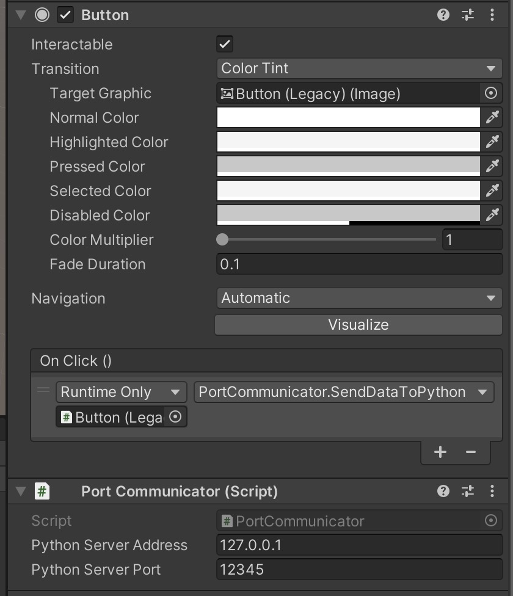

# python-unity-communicator
Segment images and generate cartoons with RESNET and OpenAI. The process includes communication between C# (Unity) and Python. 

## Default

Server Address: `127.0.0.1`

Server Port: `12345`

(Modify in `Assets/PythonClient.py` and `Assets/PortCommunicator.cs` and Unity Inspector)

## Usage

1. Create a Python venv based on `environment.yml`

2. Activate the venv and run `Assets/PythonClient.py`

   > ⚠️ **Always run `PythonClient.py` synchronously with Unity** to open port listener!!!

3. Attach the `Assets/PortCommunicator.cs` script to an object in the Unity scene and select a way to trigger `PortCommunicator.SendDataToPython()`

   > Example:
   >
   > 
